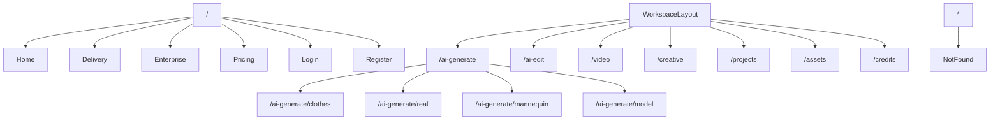
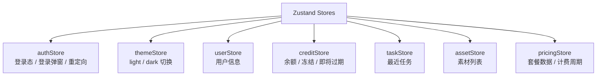
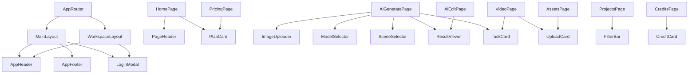

# 项目架构文档

## 1. 产品分析

### 1.1 目标用户

- 服装电商商家
- 服装品牌内容团队
- 广告与视觉服务团队
- 海外站内容运营团队

### 1.2 核心用户价值

- 降低传统拍摄与修图成本
- 提升商品图、模特图、视频内容生产效率
- 建立统一的 AI 内容工作台与素材资产中心

### 1.3 业务价值

- 通过套餐和积分完成商业化闭环
- 通过企业版实现高客单与定制化增长
- 通过项目、素材、任务沉淀长期使用粘性

### 1.4 MVP 范围

P0：

- 首页获客
- 登录注册
- AI 在线生成
- AI 编辑
- 视频生成
- 成片交付
- AI 创意生图
- 企业版介绍
- 项目管理
- 素材管理
- 积分中心
- 套餐中心
- Light / Dark 主题系统
- Mock 数据与前端工程框架

P1：

- 任务详情抽屉
- 预览对比
- 更多筛选
- 表单校验与状态细化

P2：

- 真实 API 接入
- 上传分片
- 长任务轮询
- 企业 API 文档中心
- 私有化部署工作台

## 2. 页面结构

### 2.1 首页结构

```text
Header
Hero
数据背书
核心能力
案例展示
企业方案
套餐入口
FAQ
Footer
```

### 2.2 AI 在线生成结构

```text
WorkspaceLayout
├─ 左侧：上传区 + 参数面板
├─ 中部：结果展示
├─ 下部：模特库 / 场景库
└─ 底部：最近生成任务
```

### 2.3 AI 编辑结构

```text
WorkspaceLayout
├─ 左侧：工具栏
├─ 中部：工作区 / 预览区
└─ 右侧：参数面板 / 前后对比
```

## 3. 路由结构图



## 4. 状态管理结构图



## 5. 组件关系图



## 6. 目录结构

```text
Fashion-Desgin
├─ docs
│  └─ project-architecture.md
├─ public
├─ src
│  ├─ api
│  ├─ assets
│  ├─ business
│  ├─ components
│  │  └─ common
│  ├─ hooks
│  ├─ layouts
│  ├─ mock
│  ├─ pages
│  ├─ providers
│  ├─ router
│  ├─ services
│  ├─ store
│  ├─ styles
│  ├─ types
│  └─ utils
├─ README.md
├─ package.json
└─ vite.config.ts
```

## 7. 主题设计方案

### 7.1 实现方式

- `ThemeProvider` 负责把状态同步到 `html[data-theme]`
- `themeStore` 负责记忆用户主题偏好
- `tokens.scss` 提供全部语义化变量
- 页面组件统一消费 `var(--*)`

### 7.2 关键原则

- 不在页面组件中硬编码业务主色
- Light / Dark 首次实现就覆盖全部页面
- 优先用语义变量，而不是场景特定颜色名

## 8. Mock 数据架构

### 8.1 数据分层

```text
mock/data.ts
  -> mockService.ts
    -> React Query / 页面
```

### 8.2 当前覆盖数据

- 用户
- 套餐
- 积分
- 任务
- 模特
- 场景
- 素材
- 项目
- 流水

## 9. API 边界设计

### 9.1 当前方式

- 页面通过 React Query 请求 `mockService`
- store 只保存前端交互态与局部缓存态
- `api/client.ts` 预留 Axios 实例与拦截器

### 9.2 后续真实接口对接说明

1. 将 `mockService` 的方法按模块拆分到 `src/api` 或 `src/services`
2. 使用 `apiClient` 统一处理：
   - baseURL
   - token 注入
   - refresh token
   - 错误提示
3. 为每个业务模块补 `types/dto`
4. 保持页面层 `useQuery` 的 queryKey 不变
5. 上传类接口单独封装，支持进度与取消

## 10. 待接入 AI 接口清单

- AI 衣服图生成
- AI 真人图生成
- AI 人台图生成
- AI 模特替换
- AI 编辑工具箱
  - 智能补光
  - 智能美化
  - 魔法擦除
  - 画质升级
  - 随心变形
  - 智能抠图
- 视频生成
- 创意生图
- 模特库查询
- 场景库查询
- 任务状态轮询
- 结果下载
- 项目详情
- 素材上传与标签管理
- 积分流水查询
- 套餐购买与支付

## 11. 页面截图说明

本地页面可通过：

```bash
npm run dev
```

默认访问：

- `http://localhost:5173`

推荐截图页面：

- 首页
- `/ai-generate/clothes`
- `/ai-edit`
- `/video`
- `/pricing`
- `/projects`
- `/assets`
- `/credits`

## 12. 当前验证结果

- `npm install` 成功
- `npm run build` 成功
- 路由懒加载已生效
- Mock 数据链路可用
- 主题系统可切换

## 13. 已知后续优化项

- Arco 样式体积较大，可继续做 manual chunk 与组件级拆分
- 全局样式中的 Sass `@import` 可迁移到 `@use`
- 图片目前使用占位远程图，后续可替换为品牌样图资源
- 业务目录已预留，但首阶段主要把页面级框架打通，后续可继续向 `business/*` 拆分
